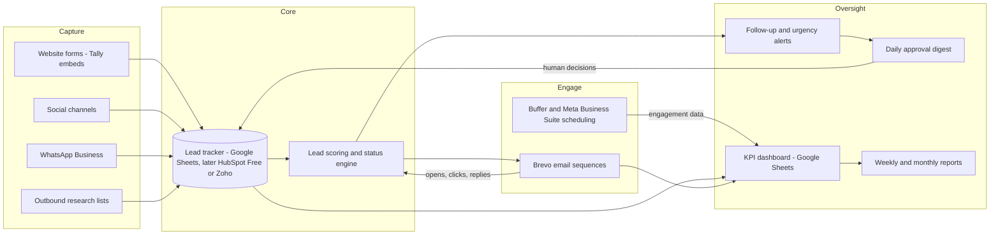

# Marketing Technology and Automation Architecture

**AGIX Agribusiness & Agritech Expo 2027**
Friday 9 – Saturday 10 April 2027 | Amadeo Event Center, Ebeano Tunnel Road, Enugu, Nigeria
Organiser: AGIX Africa | www.agixafrica.com/expo2027

**Purpose:** This document defines the marketing technology stack and automation architecture for the expo marketing programme: recommended tools (free/low-cost defaults), the integration and data-flow map, an automation coverage table for every required capability, a phased setup plan for the first four weeks, and an indicative tooling cost table. It is designed to deliver at least 90% automation with human involvement limited to credentials, approvals and payments.

**Owner:** Virtual Marketing Assistant (autonomous) / **Human approval required for:** creating accounts and providing credentials, any paid subscription or advertising spend, connecting tools to official AGIX Africa accounts, and approval of the recommended stack below before setup begins.

---

## 1. Recommended stack

| Layer | Recommended default | Alternatives considered | Rationale |
|-------|---------------------|-------------------------|-----------|
| CRM / lead base | Google Sheets master tracker now → HubSpot Free CRM later (Zoho CRM free tier as alternative) | Airtable free | Zero cost, instant start, clean 1:1 migration path defined in `lead-management-system.md` §8. |
| Email marketing | **Brevo (recommended)** | Mailchimp, MailerLite | Brevo's free tier is sender-friendly for our expected volume (daily send allowance rather than a hard small contact cap), includes automation workflows and transactional email, and prices later tiers by sends not contacts — suits a growing database. Mailchimp's free tier is now very restricted; MailerLite is a good fallback if Brevo deliverability disappoints in Nigeria-heavy lists. |
| Social scheduling | Meta Business Suite (Facebook/Instagram, free, native) + Buffer free plan for LinkedIn/X | Hootsuite, Later | Native Meta scheduling is free and reliable; Buffer's free plan covers the remaining channels at low volume. Consolidate on one paid scheduler only if volume demands it. |
| Design | Canva (free tier; Pro [pending approval] if brand-kit and resize features prove necessary) | Figma, Adobe Express | Template-driven, fast batch production of social and print-ready assets. |
| Website / landing pages | [Existing site — www.agixafrica.com/expo2027, platform to confirm] + embedded forms | Carrd/Framer for standalone landers if the site is hard to edit | Keep authority on the existing domain; add UTM-tagged landing sections per campaign. |
| Forms | Tally (recommended: free, unlimited responses, clean embeds) | Google Forms | Tally for public-facing forms (exhibitor enquiry, registration interest, speaker application); Google Forms acceptable for internal use. |
| Messaging | WhatsApp Business (app, free) on a dedicated event number [to be provided] | WhatsApp Business API via BSP (later, paid) | Primary channel for Nigerian lead follow-up; quick replies, labels mirroring lead statuses, catalogue for packages. |
| Analytics | GA4 on the expo pages + UTM convention (below) | Plausible | Free, standard, integrates with Ads later. |
| Advertising | Google Ads, Meta Ads, LinkedIn Ads — accounts prepared but **dormant until budget approved** | — | No spend authority exists; structure and audiences can be drafted in advance. |
| Cloud storage | Google Drive shared folder | OneDrive | Structure: `/AGIX-Expo-2027/ 01-strategy, 02-brand-assets, 03-content (by month), 04-operations, 05-leads-and-reports (restricted), 06-partners-media, 07-approvals-archive`. |
| Task management | Google Sheets task board now; Trello free if visual board preferred | Asana, Notion | Lowest-friction; tasks already surface via daily workflow. |
| Calendar reminders | Google Calendar (shared "AGIX Expo Marketing" calendar) | — | Milestones pre-loaded: 90 days = 9 January 2027; 60 days = 8 February 2027; 30 days = 10 March 2027; 14 days = 26 March 2027; 7 days = 2 April 2027. |

**UTM convention:** `utm_source` = platform (facebook, linkedin, email, whatsapp, partner-name), `utm_medium` = channel type (social, email, referral, cpc), `utm_campaign` = `expo2027-[campaign]-[month]` (e.g. `expo2027-exhibitor-launch-aug26`), `utm_content` = creative/variant. Lower-case, hyphenated, no spaces; a UTM builder tab lives in the KPI workbook.

---

## 2. Integration and data-flow map

Flow summary: leads captured from any channel land in the CRM; the scoring/status engine assigns score and sequence; Brevo runs the matching email sequence; engagement feeds back into scoring; urgency rules raise alerts into the daily digest; everything reports into the KPI dashboard and the weekly/monthly reports.

---

## 3. Automation coverage table

| Capability | Tool | Automation level | Setup summary | Human action needed |
|------------|------|------------------|---------------|---------------------|
| Lead capture | Tally forms → Sheets; WhatsApp; social inboxes | Full (forms) / Assisted (inbox triage) | Build enquiry, registration-interest and speaker forms; connect Tally's native Google Sheets sync to the tracker; UTM fields hidden in forms. | Approve form copy; provide site access to embed. |
| Lead classification and scoring | Google Sheets formulas (later CRM workflows) | Full | Implement §4 scoring from `lead-management-system.md` as formula columns; dropdown validation for type/sector/status. | None after tracker approval. |
| Email sequencing | Brevo automations | Full once templates approved | Build welcome, exhibitor-nurture, sponsor-nurture and registration-reminder workflows; trigger by list/segment attributes synced from tracker. | Create Brevo account, verify sending domain (DNS records), approve templates. |
| Content scheduling | Meta Business Suite + Buffer | Full within approved batches | Connect pages/profiles; load approved weekly batches; evergreen queue for countdown content. | Provide social account access; weekly batch approval (standing approval). |
| Calendar reminders | Google Calendar | Full | Load countdown milestones, campaign start dates, report deadlines, follow-up SLAs as recurring events. | Share calendar access. |
| Follow-up alerts | Sheets conditional logic → daily digest | Full | Urgency rules (U1–U7) computed daily; flagged rows compiled into digest automatically. | Act on digest items only. |
| Performance reporting | Sheets KPI workbook + platform exports | Assisted | Weekly data-entry routine per `kpi-dashboard.md` §3; lead metrics auto-pulled; platform metrics keyed weekly until API access approved. | Provide analytics access (GA4, Meta, LinkedIn). |
| Document generation | Markdown/Docs templates + Canva | Full for drafts | Prospectuses, one-pagers, proposals generated from approved templates with merge fields (organisation, package, [pricing]). | Approve master templates and pricing before any external use. |
| Onboarding flows (confirmed exhibitors/sponsors) | Brevo sequence + Drive welcome pack | Full once designed | Trigger on Status = Confirmed: welcome email, logistics pack, logo/asset request, invoice hand-off note. | Approve pack contents; handle invoicing/signatures. |
| Registration reminders | Brevo + WhatsApp broadcast lists | Full (email) / Assisted (WhatsApp) | Reminder cadence keyed to countdown milestones (9 Jan, 8 Feb, 10 Mar, 26 Mar, 2 Apr 2027). | Approve reminder copy batch. |
| Weekly reviews | Reporting templates + task board | Full | Weekly report auto-compiled Friday from tracker + KPI workbook per `reporting-templates.md`. | Read; decide on flagged items. |

---

## 4. Phased setup plan (weeks 1–4)

| Week | Focus | Actions |
|------|-------|---------|
| Week 1 (10–17 Jul 2026) | Foundations | Drive folder structure; lead tracker live from template; shared calendar with milestones; access/credential requests issued (see `next-7-days-priority-list.md`); UTM convention adopted. |
| Week 2 | Capture and email | Tally forms built and embedded [site access dependent]; Brevo account created [human], domain authentication DNS records installed [human/webmaster]; welcome sequence drafted for approval; GA4 verified on expo pages. |
| Week 3 | Scheduling and sequences | Social accounts connected to Meta Business Suite and Buffer; first approved content batches scheduled; exhibitor and sponsor nurture sequences activated with approved templates; WhatsApp Business configured with labels and quick replies. |
| Week 4 | Reporting and hardening | KPI workbook fully wired to tracker; first full weekly report produced from live data; urgency-alert automation verified end-to-end; backup routine tested; dormant ad-account structures drafted (no spend). |

---

## 5. Estimated monthly tooling cost — [proposal pending approval]

All figures are indicative list-price estimates for planning only, stated as [pending verification at sign-up]; the default configuration runs at zero cost.

| Tool | Free-tier plan (default) | Paid option if/when needed | Indicative monthly cost if upgraded |
|------|--------------------------|----------------------------|-------------------------------------|
| Google Sheets / Drive / Calendar | Free | Google Workspace for custom-domain email | [~US$6–12 per user] |
| Brevo | Free | Higher send volume + marketing automation tier | [~US$9–25] |
| Buffer | Free | More channels/queue slots | [~US$5–15] |
| Meta Business Suite | Free | — | — |
| Canva | Free | Canva Pro | [~US$12] |
| Tally | Free | Pro (custom domains, removal of branding) | [~US$29] |
| WhatsApp Business app | Free | API via BSP (only at scale) | [usage-based] |
| GA4 | Free | — | — |
| HubSpot Free / Zoho CRM | Free | Paid CRM tiers | [deferred decision] |
| Ads (Google/Meta/LinkedIn) | ₦0 — dormant | Media budget | [entirely pending budget approval] |
| **Total, default configuration** | **₦0 / US$0 per month** | | |

**Recommendation:** launch on the all-free configuration; review upgrade triggers (send limits, scheduling limits, brand-kit need) at the first monthly strategic review and present any paid upgrade as an A1 spending decision in the approval register.

---

*Related documents: `lead-management-system.md`, `kpi-dashboard.md`, `approval-escalation-register.md`, `reporting-templates.md`, `next-7-days-priority-list.md`.*
